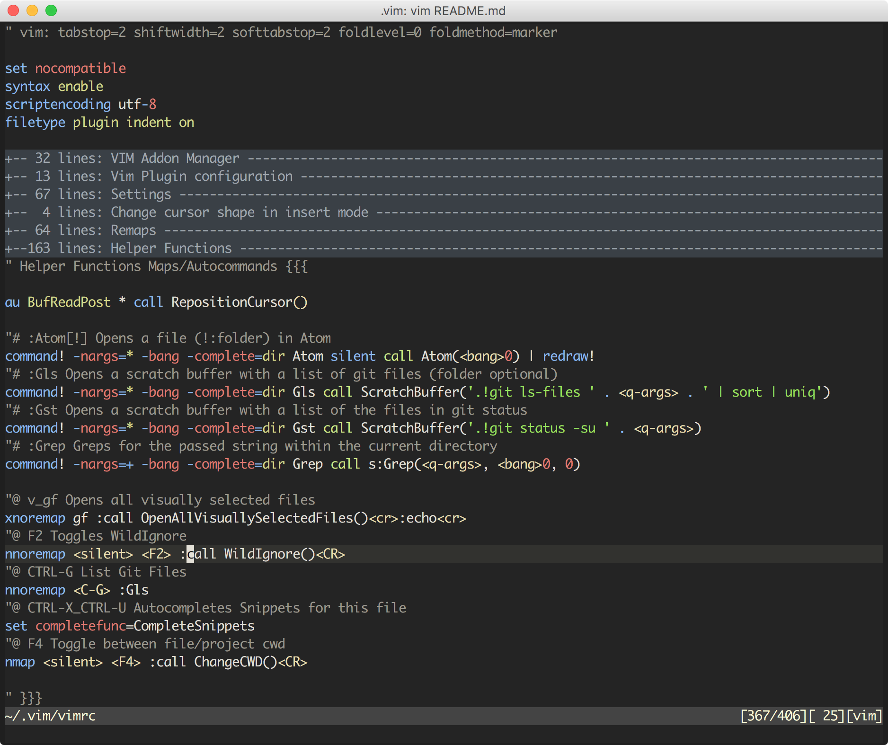

# Vim

This vim configuration uses [vim addons manager](https://github.com/MarcWeber/vim-addon-manager)
to handle the plugins.

### Included plugins:
- [heavenshell/vim-jsdoc](http://github.com/heavenshell/vim-jsdoc): Generates JSDoc block comments based on a function signature
- [sirver/ultisnips](http://github.com/sirver/ultisnips): UltiSnips is the ultimate solution for snippets in Vim
- [pangloss/vim-javascript](http://github.com/pangloss/vim-javascript): Vastly improved Javascript indentation and syntax support in Vim
- [editorconfig/editorconfig-vim](http://github.com/editorconfig/editorconfig-vim): EditorConfig plugin for Vim
- [sheerun/vim-wombat-scheme](http://github.com/sheerun/vim-wombat-scheme): An enhanced wombat256 color scheme for Vim

## ColorScheme: wombat

# Mappings
|Key|Action|
|---|------|
|SPACE-D| Inserts JSDoc Block|
|*| Prevent jump to next match|
|Y| Make (Y)ank behave like (D)elete or (C)hange|
|BS| Hide search results|
|cgf| Forced go to file|
|TAB| Show buffer list|
|CTRL-N| Next buffer|
|CTRL-P| Previous buffer|
|CTRL-C| Close buffer|
|<Leader>-CTRL-C| Force close previous buffer|
|CTRL-S| Search|
|s| Stamp text to terminal|
|F2| Toggles WildIgnore|
|CTRL-G| List Git Files|
|CTRL-X_CTRL-U| Autocompletes Snippets for this file|
|F4| Toggle between file/project cwd|
|v_*| Search visually selected text|
|v_CTRL-S| Search visually selected string|
|v_gf| Opens all visually selected files|
|c_CTRL-P| Up|
|c_CTRL-N| Down|
|c_CTRL-A| Start of the line|
|c_CTRL-E| End of the line|
|c_CTRL-X| Insert current line|
|i_TAB| Triggers snippet completion|
|i_S-Up| Jumps to previous placeholder|
|i_S-Down| Jumps to next placeholder|
|i_Shift-Right| List all snippets|

## New commands
|Command| Actions |
|-------|---------|
|:Atom[!]| Opens a file (!:folder) in Atom
|:Gls [folder]| Opens a scratch buffer with a list of git files (folder optional)
|:Gst| Opens a scratch buffer with a list of the files in git status
|:Grep [search pattern]| Greps for the passed string within the current directory

## More Details
If you want to know more, have a read at the [vimrc](vimrc) file.
